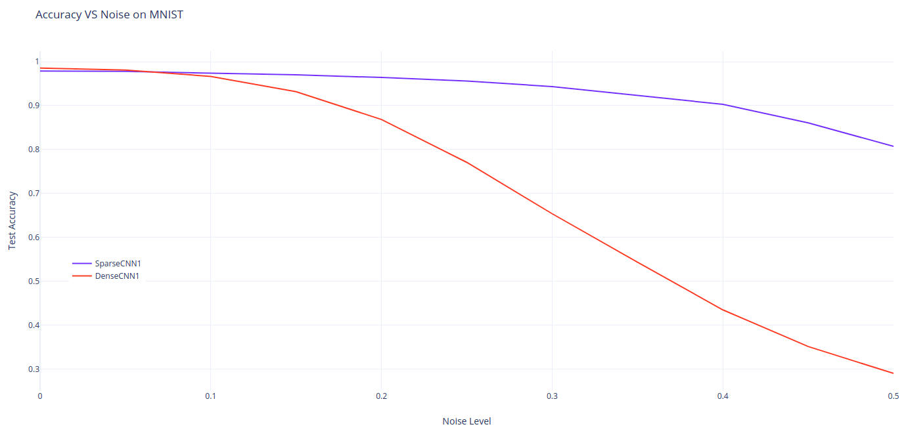

# SparseCNN
A Tensorflow implementation of the [How Can We Be So Dense? The Benefits of Using Highly Sparse Representations](https://arxiv.org/pdf/1903.11257.pdf).

### Implementation

This code was tested using *TF2.0* and *python 3.6*.

```python
pip install -r requirements.txt
```

This code only implement the simple CNN architectures SparseCNN1 and DenseCNN1

To test other architectures, you can modify the [`sparse_net.py`](sparse_net.py) or [`dense_net.py`](dense_net.py)  

To launch training SparseCNN1 as described in the paper
```python
python train_evaluate.py
```

### Results
As described in the paper, the sparseCNN shows more robustness to white noise in the inputs.

<br />
<div align="center">
 
<br />


